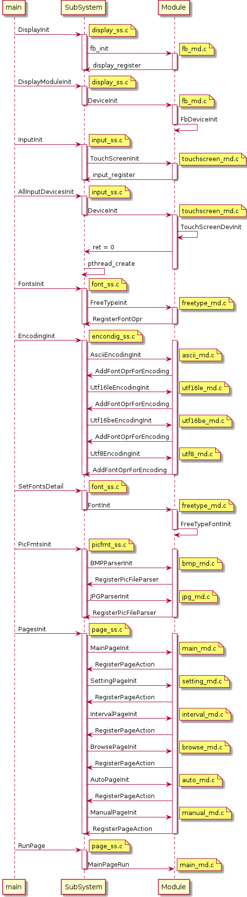
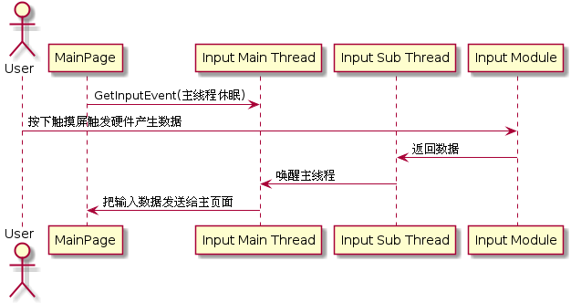
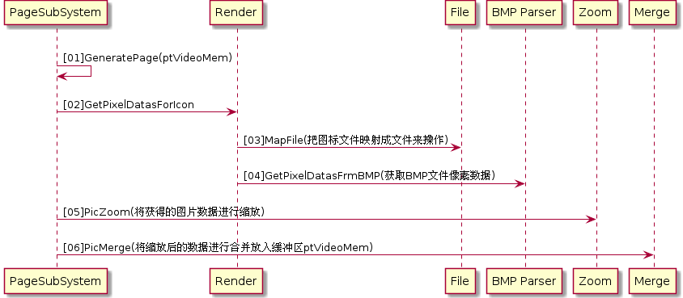

# digital photo frame(DPF)

## 写在最前面的话

本项目是韦东山视频数码相框的复刻版,做了如下修改

- 所有链表操作使用和内核一致的接口(完全从Linux内核源代码移植过来的)

## 简明架构框图

## 函数调用简图

## 主页面输入事件处理

输入子系统会创建子线程用接受底层驱动输入数据

主线程在没有数据时休眠

在子系统接收到数据后会唤醒主线程并将数据传递给主线程

## 生成页面数据函数分析

GeneratePage调用流程简图

## Usage

### FreeType

- 安装

假设将交叉编译的给开发板用的freetype库目录在下面这个目录里(没有拷贝到交叉编译工具链中)

	/home/zeroway/armlinux/freetype/freetypelibs

- 使用

则在顶层Makefile中设置了这个目录

	FTLIB  	:= -L/home/zeroway/armlinux/freetype/freetypelibs/usr/local/lib
	CFLAGS  += -I/home/zeroway/armlinux/freetype/freetypelibs/usr/local/include

### TS Lib

- 安装

	TBD

- 使用

	TBD

## 开发板设置

环境变量设置

	/dev/event0    对应的是触摸屏
	/dev/fb0	   对应的是LCD
	export TSLIB_TSDEVICE=/dev/event0
	export TSLIB_CALIBFILE=/etc/pointercal
	export TSLIB_CONFFILE=/etc/ts.conf
	export TSLIB_PLUGINDIR=/lib/ts
	export TSLIB_CONSOLEDEVICE=none
	export TSLIB_FBDEVICE=/dev/fb0

## Misc

### plantuml画函数调用图

安装plantuml

	emerge media-gfx/plantuml

使用

	java -jar /usr/share/plantuml/lib/plantuml.jar sequenceDiagram.txt
