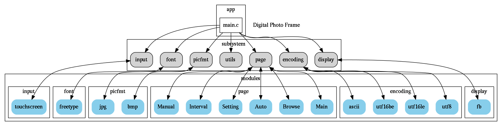

# digital photo frame(DPF)

## 写在最前面的话

本项目是韦东山视频数码相框的复刻版,做了如下改

- 所有链表操作使用和内核一致的接口(完全从Linux内核源代码移植过来的)

## 简明架构框图

## 开发板设置

环境变量设置

	/dev/event0    对应的是触摸屏
	/dev/fb0	   对应的是LCD
	export TSLIB_TSDEVICE=/dev/event0
	export TSLIB_CALIBFILE=/etc/pointercal
	export TSLIB_CONFFILE=/etc/ts.conf
	export TSLIB_PLUGINDIR=/lib/ts
	export TSLIB_CONSOLEDEVICE=none
	export TSLIB_FBDEVICE=/dev/fb0
